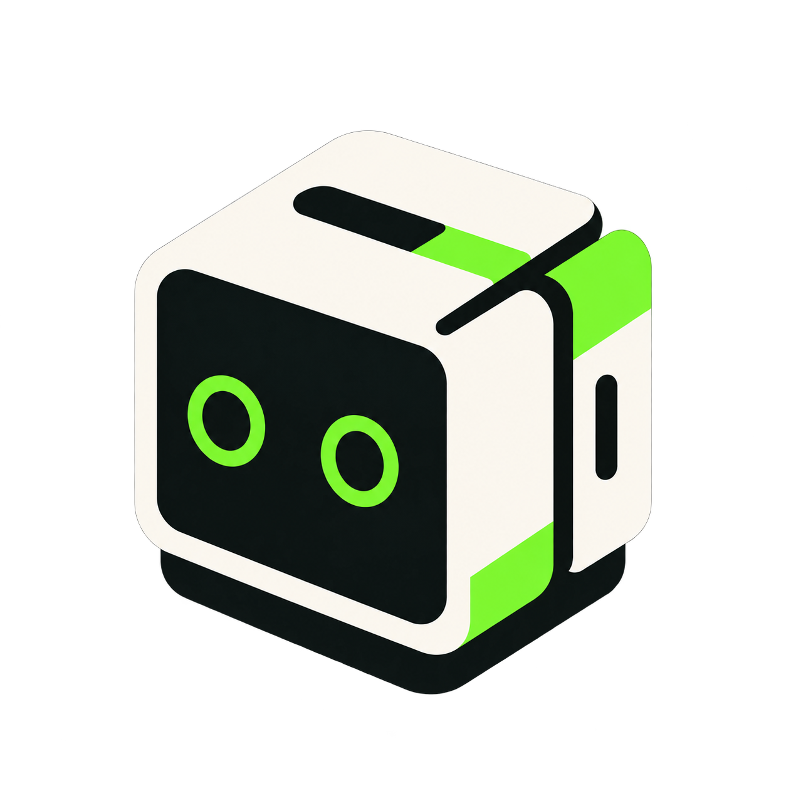

<div align="center">
  
  <h1>Kubren</h1>
  <p><strong>A persistent autonomous AI city builder for Minecraft.</strong></p>
  <p>
    <a href="https://kubren.fun/">Website</a> ·
    <a href="https://x.com/kubrenrunit">X / Twitter</a> ·
    <a href="https://pump.fun/coin/8DnC77eU79LwhsmS833SvqK1TjqLz6XZM7MvuXa5pump">Pump.fun</a>
  </p>
</div>

Kubren designs and builds a growing city in a live Minecraft world. The repository contains the retro static frontend and a small runnable Mineflayer starter that can build validated structures with or without an OpenAI-compatible model.

> Official contract address: `8DnC77eU79LwhsmS833SvqK1TjqLz6XZM7MvuXa5pump`

## Frontend

The site is static and requires no build step.

```powershell
python -m http.server 8081
# open http://127.0.0.1:8081/
```

Pages:

- `index.html` — entry page, social links and in-page repository preview
- `story.html` — Kubren's origin story
- `home/index.html` — live dashboard, map, feed, chat and guestbook layout

The live camera, map and data URLs belong in `home/config.js`. They are blank by default so a new deployment does not inherit another project's services.

## Runnable builder starter

```powershell
cd kubren-starter
npm install
Copy-Item config.example.json config.json
npm start
```

Requirements:

- Node.js 18+
- Minecraft Java server, default `127.0.0.1:25565`
- Operator permission for the configured bot username
- Optional OpenAI-compatible API key; safe built-in presets work without one

The model cannot emit raw commands. It only proposes a building name, an allowlisted material and bounded dimensions. Local deterministic code constructs every Minecraft command.

## Repository layout

```text
kubren/
|-- index.html
|-- story.html
|-- kubren-transparent.png
|-- badges/
|-- home/
|   |-- index.html
|   |-- config.js
|   `-- javascript/
|-- kubren-starter/
|   |-- package.json
|   |-- config.example.json
|   `-- src/index.js
`-- .github/workflows/pages.yml
```

## Links

- Website: https://kubren.fun/
- X: https://x.com/kubrenrunit
- Pump.fun: https://pump.fun/coin/8DnC77eU79LwhsmS833SvqK1TjqLz6XZM7MvuXa5pump
- Repository: https://github.com/zunonhood/kubren

## License

MIT